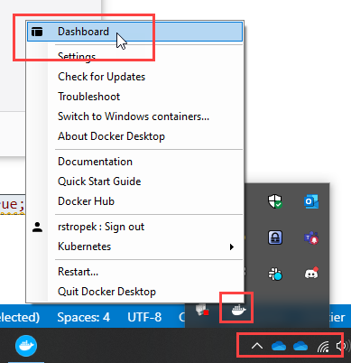
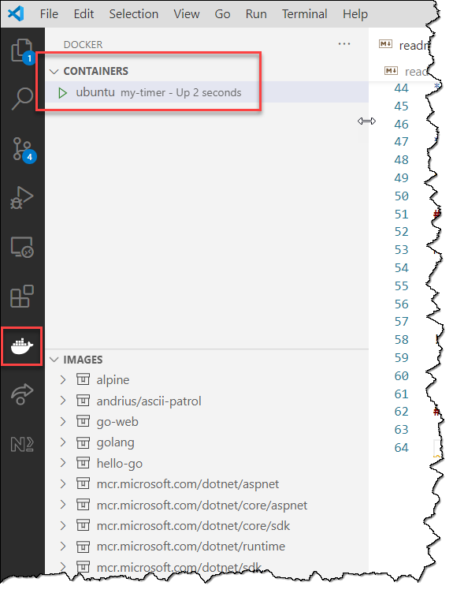
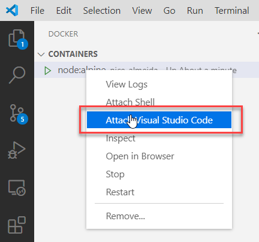
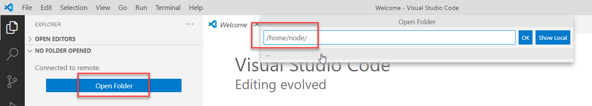

# Manage Docker Containers

## Introduction

In this exercise, you learn how to manage Docker containers.

In order to follow along, you need the following prerequisites:

* A running Docker daemon ([Installation guides](https://docs.docker.com/get-docker/))
* The Docker CLI
  * If you use *Docker Desktop*, it is installed automatically
  * Linux: If you work on the machine were the Docker daemon runs, the CLI is automatically available
  * If you need to install the Docker CLI manually (e.g. because you access a remote Docker daemon), you can download the binaries for [MacOS](https://download.docker.com/mac/static/stable/x86_64/), [Linux](https://download.docker.com/linux/static/stable/x86_64/), and [Windows](https://download.docker.com/win/static/stable/x86_64/)
* [Visual Studio Code](https://code.visualstudio.com) with the following extensions/extension packs:
  * [Docker Extension](https://marketplace.visualstudio.com/items?itemName=ms-azuretools.vscode-docker)
  * [Remote Development](https://marketplace.visualstudio.com/items?itemName=ms-vscode-remote.vscode-remote-extensionpack)

## Cleanup (Optionally)

* Use `docker ps -a` to make sure that no containers are running.
* If containers are still running, remove all of them: `docker rm -f <container id or name>`

## Starting a Container

* Run an interactive container with Ubuntu: `docker run -it --rm --name my-ubuntu ubuntu`
  * Note that Ubuntu is automatically downloaded if it is not already on your system.
  * Try an `ls -la` command in Ubuntu to see if everything is working.
  * `exit` from Ubuntu.
  * Verify that the container has been deleted with `docker ps -a`. Note that it has been deleted because of `--rm` switch in `docker run`.

## Starting a Container in the Background

* Start a container in the background that prints the current time every second: `docker run -d --name my-timer ubuntu /bin/bash -c "while true; do date; sleep 1; done"`
* Verify that container is running: `docker ps`
* Watch clock ticking by attaching to log stream: `docker logs my-timer -f` (exit log stream with *Ctrl+C*)
* Start an interactive bash shell in existing container: `docker exec -it my-timer bash`
* Verify that bash loop is still running: `ps -aux`
* `exit` from bash shell
* Stop and remove container: `docker rm -f my-timer`

## Starting a Console Game

* Open [Docker Hub](https://hub.docker.com)
  * This is where all Docker images (=basis of Docker containers) come from
* Use the *Search* bar to look for image *ubuntu*. We used it in the previous exercises.
* Open the [ascii-patrol](https://hub.docker.com/r/andrius/ascii-patrol) image on the Docker hub.
* Pull down the image with `docker pull andrius/ascii-patrol`.
* Start the console game and have fun: `docker run -it --rm --name ascii-patrol andrius/ascii-patrol`

## Manage Docker Images With GUI

### Docker Desktop Dashboard

Note: This exercise requires *Docker Desktop*.

* Start the background container again: `docker run -d --name my-timer ubuntu /bin/bash -c "while true; do date; sleep 1; done"`
* Start the *Docker Desktop Dashboard* and look for the container you just started.

* Spend a few minutes to make yourself familiar with the dashboard.

### Visual Studio Code

Note: This exercise requires *Visual Studio Code*.

* Start the background container again: `docker run -d --name my-timer ubuntu /bin/bash -c "while true; do date; sleep 1; done"`
* Start *Visual Studio Code*
* Start the *Docker* Extension in *Visual Studio Code* and look for the container you just started.

* Spend a few minutes to make yourself familiar with the Docker VSCode extension.

## Use Docker Image to Develop in a Container

Note: This exercise requires *Visual Studio Code*.

* Start a container with Node.js. Keep it running by starting a program that does never exit: `docker run -d --name node-dev node:alpine tail -f /dev/null`
* Start *Visual Studio Code*
* Start the *Docker* Extension in *Visual Studio Code* and look for the *node-dev* container you just started.
* Attach an instance of VSCode to the container (might take a few moments):

* Note that all you do in VSCode is now done **within** the container.
* Click on *Open Folder* and enter */home/node*.

* Create a file *app.js* in the opened folder. Write any Node.js code you like (e.g. `console.log('Hello World!');`).
* Open a terminal (*View/Terminal*) and run your program: `node app.js`
* Close VSCode and remove the *node-dev* container.
  * Note that all your work is **lost** when you remove the container. If you want to keep it, make sure to store it outside of the container (e.g. check it in into GitHub).
