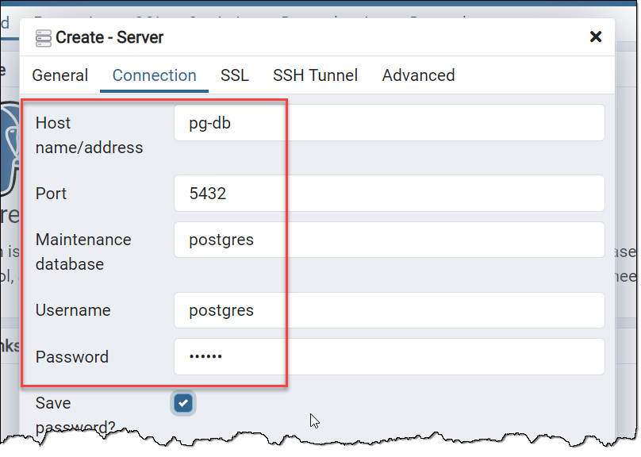

# Docker Networking

## Prerequisites

**Note** that this exercise assumes that you have done [the previous exercise](https://github.com/rstropek/DockerVS2015Intro/tree/master/dockerDemos/labs/010-manage-docker-containers).

## Create Network for Postgres Database

* Check all existing networks: `docker network ls`
* Create a Docker network for our Postgres DB: `docker network create -d bridge pg-net`
* Verify that network has been created: `docker network ls`

## Start Postgres Database

* Start Postgres DB with the following command: `docker run -d -e POSTGRES_PASSWORD=secret --net pg-net --name pg-db postgres`
  * Note `--net pg-net` parameter. This connects our container to the previously created network.
* Verify that Postgres runs with the proper `docker ps` and `docker logs` commands.

## Start Postgres Admin UI

* Start Postgres Admin UI with the following command: `docker run -d -e PGADMIN_DEFAULT_EMAIL=admin@demo.com -e PGADMIN_DEFAULT_PASSWORD=secret -e PGADMIN_LISTEN_PORT=80 --net pg-net -p 8080:80 --name pg-admin dpage/pgadmin4`
  * Note `-p 8080:80` parameter. This mounts port 80 from the container to port 8080 on your machine.
  * Note `--net pg-net` parameter. This connects our container to the previously created network.
* Open Postgres Admin UI on `http://localhost:8080`
  * Note that you can use the Postgres' container name *pg-db* as the connection's server name because DNS works inside our new network.
  * The default user is *postgres*. The default database is *postgres*.



## Access Database With CLI

* Start an interactive container in your network: `docker run -it --rm --net pg-net --name pg-cli postgres /bin/bash`
* Connect to the Postgres server using the [psql](https://www.postgresql.org/docs/13/app-psql.html) tool: `psql -h pg-db postgres postgres`
* Play around with the database. Sample script:

```sql
CREATE TABLE MyTab (ID int);
INSERT INTO MyTab values (42);
SELECT * FROM MyTab;
```

* Exit the container. Because of `--rm`, it will be automatically deleted.

## Cleanup

* Use proper `docker ps` and `docker rm` command to stop and remove all Postgres-related containers.

## Using Docker Compose to Simplify Setup

**Note** that you might need to install *Docker Compose* for this exercise. Try running `docker-compose`. If it is not installed, following [these install instructions](https://docs.docker.com/compose/install/#install-compose).

* Create an empty folder
* Create a file *docker-compose.yml* in this folder.
* Copy the following code in the file:

```yml
version: "3.8"
services:
  pg-db:
    image: postgres
    environment:
      POSTGRES_PASSWORD: secret

  pg-admin:
    image: dpage/pgadmin4
    environment:
      PGADMIN_DEFAULT_EMAIL: admin@demo.com
      PGADMIN_DEFAULT_PASSWORD: secret
      PGADMIN_LISTEN_PORT: 80
    ports:
      - "8080:80"
    links:
    - "pg-db:pg-db"
```

* Try to understand the structure of the compose file. Compare it to the `docker run` commands you issues before.
* Start the entire Postgres infrastructure with a single command: `docker-compose up`
* Open Postgres Admin UI on `http://localhost:8080`
* Stop everything with *Ctrl+c*
* Remove everything: `docker-compose rm`
